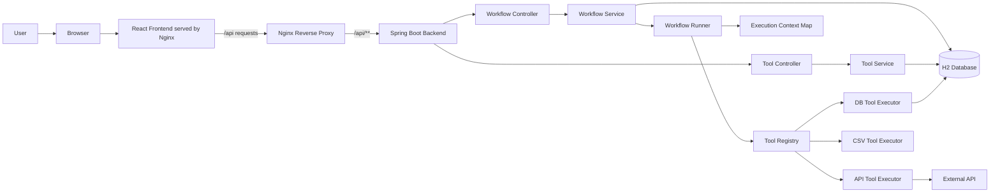
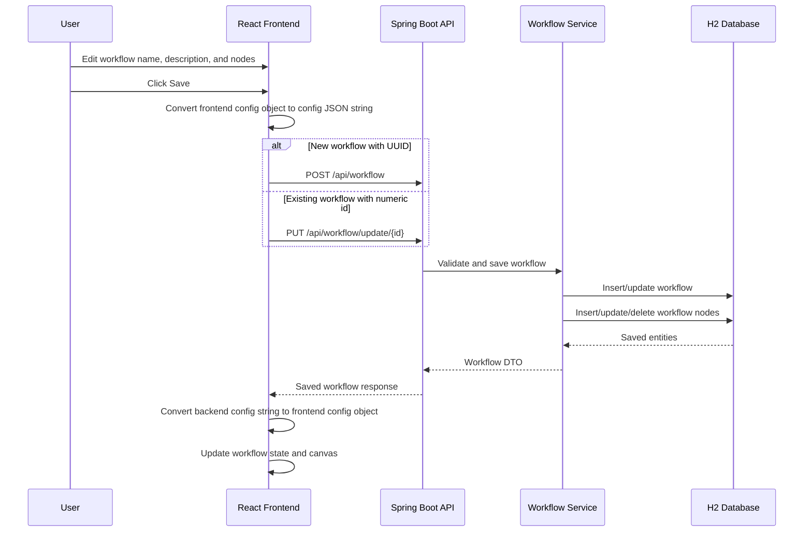

# Micro-Agent Workflow Builder

A full-stack micro-agent workflow builder that lets users configure, save, reorder, and execute sequential AI/task pipelines.

The project is intended to be generic enough to support different node and tool types such as database tools, API tools, CSV tools, and prompt nodes. However, due to time limitation, database tool are currently supported
---

## Features

- Create, edit, save, and run workflows
- Add and edit workflow nodes:
  - Input Node
  - Tool Node
  - Prompt Node
- Reorder nodes
- Delete workflow nodes
- Create and edit tools 
- Execute workflow nodes sequentially
- View execution logs and final output
- Seeded H2 database with Toronto subway delay data
- Dockerized frontend and backend
- Nginx reverse proxy to avoid CORS issues in Docker

---

## Tech Stack

### Frontend

- React
- TypeScript
- Vite
- Tailwind CSS
- Nginx for Docker production serving

### Backend

- Java 21
- Spring Boot
- Spring Web
- Spring Data JPA
- H2 Database
- Lombok
- Jackson
- Spring AI / OpenAI integration

### Database

- H2 in-memory database for local development and assignment demonstration

---

## Project Structure

```txt
.
├── assignment
│   ├── src/main/java
│   ├── src/main/resources
│   │   ├── application.properties
│   │   └── data.sql
│   ├── Dockerfile
│   └── pom.xml
│
├── toronto-assignment-ui
│   ├── src
│   ├── nginx.conf
│   ├── Dockerfile
│   ├── package.json
│   └── vite.config.ts
│
├── docker-compose.yml
├── .env.example
└── README.md
```

---

## Environment Variables

The backend is configured using environment variables. Do not commit real API keys.

Create a `.env` file in the project root:

```env
OPENAI_API_KEY=your_openai_api_key_here

SERVER_PORT=8080

DB_URL=jdbc:h2:mem:workflowdb
DB_DRIVER=org.h2.Driver
DB_USERNAME=sa
DB_PASSWORD=

JPA_DDL_AUTO=create-drop
SQL_INIT_MODE=always
H2_CONSOLE_ENABLED=true
```


## Setup & Run Instructions

## Run With Docker

From the project root:

```bash
docker compose up --build
```

Frontend:

```txt
http://localhost:5173
```

Backend:

```txt
http://localhost:8080
```

Stop containers:

```bash
docker compose down
```

You can also pass the OpenAI key directly from CLI.

Mac/Linux/Git Bash:

```bash
OPENAI_API_KEY=your_openai_api_key_here docker compose up --build
```

Windows PowerShell:

```powershell
$env:OPENAI_API_KEY="your_openai_api_key_here"
docker compose up --build
```

---

## CORS Handling

The production-style setup avoids CORS by routing frontend API calls through the same origin.

The frontend uses:

```ts
const API_BASE_URL = "/api";
```

In Docker:

```txt
Browser -> http://localhost:5173/api/workflow
Nginx   -> http://backend:8080/api/workflow
```

From the browser's perspective, both frontend and API are under:

```txt
http://localhost:5173
```

So CORS is avoided.

For local development, Vite proxy forwards `/api` to `http://localhost:8080`.

---

## Seed Data

The application uses H2 and seeds data on startup using:

```txt
assignment/src/main/resources/data.sql
```

The seed file includes:

- Toronto subway delay dataset
- Default DB tool
- Default workflow

The default seeded workflow is:

```txt
Toronto Subway Delay Analyst
```

Example seeded tool:

```txt
QUERY_SUBWAY_DELAY_BY_STATION
```

The seeded DB tool queries subway delay records by station.

Example tool node config:

```json
{
  "toolCode": "QUERY_SUBWAY_DELAY_BY_STATION",
  "inputMapping": {
    "station": "{{station_name}}"
  },
  "outputVariable": "delay_records"
}
```

Example input node config:

```json
{
  "variableName": "station_name",
  "value": "UNION"
}
```

---

## API Overview

### Workflow APIs

Get workflows:

```http
GET /api/workflow
```

Get specific workflow:

```http
GET /api/workflow/{workflowId}
```

Create workflow:

```http
POST /api/workflow
```

Update workflow:

```http
PUT /api/workflow/update/{workflowId}
```

Execute workflow:

```http
POST /api/workflow/{id}/run
```

### Tool APIs

Get tools:

```http
GET /api/tools
```

Get specific tool:

```http
GET /api/tools/{id}
```

Create tool:

```http
POST /api/tools
```

Update tool:

```http
PUT /api/tools/{id}
```

---

## Data Model

### Workflow

A workflow represents a sequential task pipeline.

```txt
Workflow
- id
- name
- description
- nodes
- createdAt
- updatedAt
```

### WorkflowNode

A workflow contains ordered nodes.

```txt
WorkflowNode
- id
- workflow_id
- name
- description
- position
- nodeType
- configJson
- createdAt
- updatedAt
```

Node types:

```txt
INPUT
TOOL
PROMPT
```

Node configuration is stored as JSON string in `configJson`.

Example Input config:

```json
{
  "variableName": "station_name",
  "value": "UNION"
}
```

Example Tool config:

```json
{
  "toolCode": "QUERY_SUBWAY_DELAY_BY_STATION",
  "inputMapping": {
    "station": "{{station_name}}"
  },
  "outputVariable": "delay_records"
}
```

Example Prompt config:

```json
{
  "prompt": "Summarize the delay records: {{delay_records}}",
  "outputVariable": "final_answer"
}
```

### ToolNode

A tool defines an executable backend capability.

```txt
ToolNode
- id
- code
- name
- description
- toolType
- configJson
- inputSchemaJson
- outputSchemaJson
- createdAt
- updatedAt
```

Tool types:

```txt
DB_TOOL
API_TOOL
CSV_TOOL
```

---

## Architectural Choices & Trade-offs

### Why React + TypeScript?

React was chosen because the assignment requires an interactive workflow builder. 
TypeScript helps make the different node types safer to edit and pass across components.


### Why Spring Boot?

Spring Boot was chosen because it provides a clean structure for:

- REST APIs
- Service-layer business logic
- Transaction management
- JPA persistence
- Validation
- H2 local development

The backend is separated into controller, service, repository, entity, mapper, and executor layers.

### Frontend State Management

The frontend uses React state inside a custom workflow builder hook.

The hook manages:

- Workflows
- Selected workflow
- Selected node
- Node add/update/delete/reorder operations
- Save state
- Run state
- Run result

A dedicated state library such as Redux was not used because the application scope is small enough for local React state.

New unsaved workflows use:

```ts
crypto.randomUUID()
```

Saved backend workflows use numeric IDs. This lets the frontend decide:

```txt
UUID id    -> POST new workflow
Numeric id -> PUT existing workflow
```

### Database Design

The database uses a flexible node model.

A `Workflow` owns many `WorkflowNode` records. Each node has a `position` field, which defines execution order.

Node-specific configuration is stored as JSON string in `configJson`.

Trade-off:

- Pro: Flexible and easy to add future node types
- Con: Less database-level validation of config structure

### Tool Execution Design

Tool execution is designed around a tool executor pattern.

Each tool type can have a dedicated executor:

```txt
DB_TOOL  -> DbToolExecutor
API_TOOL -> ApiToolExecutor
CSV_TOOL -> CsvToolExecutor
```

A registry maps tool type to executor. This avoids putting all tool logic inside the workflow runner.

Current application only support DbToolExecutor due to time constraint.

---

## System Architecture Diagram



---

## Save Workflow Sequence Diagram



---

## Execute Workflow Sequence Diagram

```mermaid
sequenceDiagram
    participant User
    participant FE as React Frontend
    participant API as Spring Boot API
    participant Runner as Workflow Runner
    participant Registry as Tool Registry
    participant Tool as Tool Executor
    participant DB as H2 Database
    participant LLM as OpenAI

    User->>FE: Click Run
    FE->>API: POST /api/workflow/{id}/run

    API->>Runner: Execute workflow
    Runner->>DB: Load workflow with ordered nodes
    DB-->>Runner: Workflow nodes

    For each node by position
        alt Input Node
            Runner->>Runner: Store variable in context
        else Tool Node
            Runner->>Runner: Resolve input mapping placeholders
            Runner->>Registry: Find executor by tool type
            Registry-->>Runner: Tool executor
            Runner->>Tool: Execute tool
            Tool-->>Runner: Tool output
            Runner->>Runner: Store output variable in context
        else Prompt Node
            Runner->>Runner: Resolve prompt placeholders
            Runner->>LLM: Send prompt
            LLM-->>Runner: Return response
            Runner->>Runner: Store prompt output in context
        end

        Runner->>Runner: Add node execution log
    end

    Runner-->>API: Run result with logs and final output
    API-->>FE: Execution result
    FE->>FE: Display logs and final output
```

---

## Known Limitations

- H2 is in-memory, so data resets on restart.
- Node config is stored as JSON string instead of a JSON database type.
- Current workflow execution is sequential only.
- No workflow versioning.
- No user authentication or ownership.
- Tool input/output schemas are metadata only and not fully enforced.
- Node reordering uses up/down controls instead of drag-and-drop.
- No execution history table yet.
- No proper UI error message (e.g Workflow failed but no reason given)
- Workflow must be saved before execution 

---

## What I Would Improve With 2 More Weeks

### 1. Separate workflow design from workflow execution

Currently, the workflow is executed directly from the latest saved workflow definition. A production-ready system should store workflow runs separately.

I would add:

```txt
workflow_run
workflow_run_log
workflow_snapshot_json
```

This would preserve historical runs even if the user later edits the workflow.

### 2. Use structured JSON at API level

The backend currently stores node config as JSON string. This is flexible, but the API would be cleaner if it accepted and returned config as structured JSON.

The database can still store JSON as text, but DTOs can use `JsonNode`.

### 3. Redesign database schema to allow saving of Tool level configuration

The backend currently store tool level configuration as JSON string. This is flexible but would be harder to manage when the number of configuration starts to increase.

The database should store fields that are specific to the type of tools.

### 3. Add stronger validation

I would validate:

- Tool node references an existing tool code
- Required node config fields are filled
- Prompt/tool placeholders only reference variables produced by previous nodes
- Tool input mappings match the tool's input schema

### 4. Add drag-and-drop

I would replace up/down reordering with drag-and-drop using a library such as `@dnd-kit`.

### 5. Add execution history

Every workflow run should be persisted with:

- Status
- Start time
- End time
- Node logs
- Error details
- Final output

### 6. Replace H2 with PostgreSQL

For production, I would replace H2 with PostgreSQL and manage schema changes using Liquibase.

### 7. Add user authentication

Workflows and tools should be scoped to a user or workspace.

---

## Demo Flow

1. Start the backend.
2. Start the frontend.
3. Open the workflow builder.
4. Select the seeded Toronto Subway Delay Analyst workflow.
5. Inspect the Input, Tool, and Prompt nodes.
6. Edit the input station value.
7. Save the workflow.
8. Run the workflow.
9. Review the execution logs and final output.
10. Create a new workflow and add nodes manually.
11. Create or edit tools from the Tool node editor.
12. Reorder nodes and save again.
